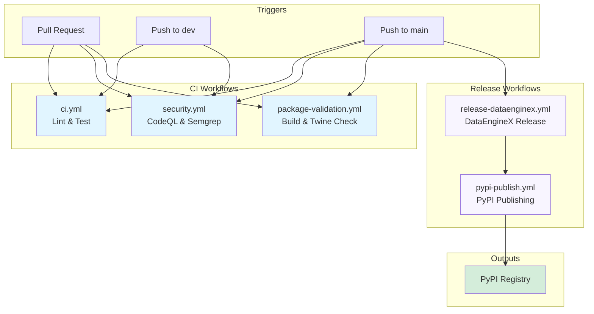
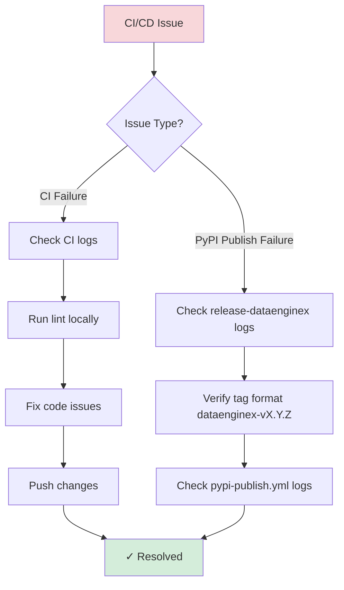

# GitHub Actions Workflows

This folder contains CI/CD automation for DEX.

> **📖 Full Documentation**: See [docs/CI_CD.md](../../docs/CI_CD.md) for comprehensive CI/CD pipeline documentation.

## Workflow Architecture



## Workflows

### `ci.yml` - Continuous Integration
**Triggers**: Push to `main`/`dev`, Pull Requests

**Jobs**:
- **lint-and-test**: Runs Ruff, import checks, mypy, and pytest with coverage

**Required for merge**: ✅ All checks must pass

---

### `security.yml` - Security Scans
**Triggers**: Push to `main`/`dev`, Pull Requests to `main`/`dev`

**Jobs**:
- **CodeQL**: Static analysis for vulnerabilities
- **Semgrep**: OWASP Top 10 checks

**Results**: GitHub Security tab

---

### `package-validation.yml` - Package Build Validation
**Triggers**: Changes to `src/dataenginex/**` or `pyproject.toml` on push/PR

**Jobs**:
- Builds wheel distribution
- Runs `twine check` to validate PyPI metadata

---

### `release-dataenginex.yml` - DataEngineX Release
**Triggers**: Version change in root `pyproject.toml` on `main` branch

**What it does**:
1. Detects version bump in `pyproject.toml`
2. Creates git tag: `dataenginex-vX.Y.Z`
3. Creates GitHub release → **automatically triggers `pypi-publish.yml`**

---

### `pypi-publish.yml` - PyPI Publishing
**Triggers**: GitHub release published (from `release-dataenginex.yml`)

**What it does**:
1. Detects changes in `src/dataenginex/` since last tag
2. Builds wheel and publishes to TestPyPI (dry-run), then PyPI

**Publish gates**:
- Only publishes if code actually changed
- Stable semver tags only for PyPI; pre-releases go to TestPyPI only

---

### `docs-pages.yml` - Documentation Deployment
**Triggers**: Push to `main` on docs/MkDocs changes, manual dispatch

**Jobs**:
- **build**: Builds MkDocs site and uploads Pages artifact
- **deploy**: Publishes site to GitHub Pages

**Custom Domain**: `docs.thedataenginex.org`

---

### `label-sync.yml` - Label Taxonomy Sync
**Triggers**: Push to `main` when `.github/labels.yml` changes, manual dispatch

**Jobs**:
- **sync-labels**: Synchronizes repository labels from `.github/labels.yml`

**Purpose**: Keeps issue/PR labels consistent with maintainer taxonomy.

---

### `project-automation.yml` - Project Intake Automation
**Triggers**: Issue/PR opened/reopened events, manual dispatch

**Jobs**:
- **add-to-org-project**: Adds new issues/PRs to org project board

**Configuration Required**:
- Variable: `ORG_PROJECT_URL`
- Secret: `ORG_PROJECT_TOKEN`

---

## Quick Reference

```bash
# Check CI status
gh pr checks <pr-number>

# View workflow runs
gh run list --workflow ci.yml

# View logs
gh run view <run-id> --log

# Trigger manual PyPI publish
gh workflow run pypi-publish.yml -f tag=dataenginex-v0.6.0
```

---

## Required Secrets

**Repository Secrets**:
- `GITHUB_TOKEN` - Auto-provided by GitHub Actions
- `ORG_PROJECT_TOKEN` - Required for project automation auto-add

**Repository Variables**:
- `ORG_PROJECT_URL` - Required for project automation auto-add

---

## Troubleshooting



### CI Failures
```bash
# Run lint locally
uv run poe lint
uv run poe test
```

### PyPI Publish Not Triggering
- Verify release tag format: `dataenginex-vMAJOR.MINOR.PATCH`
- Check that `release-dataenginex.yml` created the GitHub release
- Confirm `src/dataenginex/` files changed since last tag

---

## Related Documentation

- **[CI/CD Pipeline Guide](../../docs/CI_CD.md)** - Complete pipeline documentation
- **[SDLC](../../docs/SDLC.md)** - Development lifecycle
- **[Deploy Runbook](../../docs/DEPLOY_RUNBOOK.md)** - Release procedures
