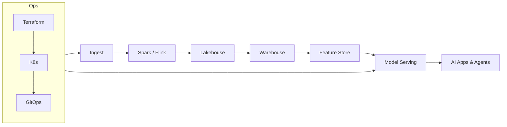

# DataEngineX (DEX)

[](https://github.com/TheDataEngineX/DEX/actions/workflows/ci.yml)
[](https://pypi.org/project/dataenginex/)
[](https://www.python.org/downloads/)
[](LICENSE)
[](https://github.com/TheDataEngineX/DEX)
[](docs/SECURITY_SCANNING.md)

A production-focused Python framework for data engineering — medallion architecture, ML lifecycle management, and enterprise observability out of the box.

______________________________________________________________________

## Quick Start

```bash
# Install
uv add dataenginex           # core only
uv add dataenginex[api]      # + FastAPI, uvicorn, structlog, OpenTelemetry

# Or pip
pip install dataenginex[api]
```

```bash
# Clone and develop
git clone https://github.com/TheDataEngineX/DEX && cd DEX
uv run poe setup             # install deps + pre-commit hooks
uv run poe dev               # dev server → http://localhost:8000
uv run poe test              # run tests
```

> **Full observability stack** (Prometheus + Grafana + Jaeger): see [infradex](https://github.com/TheDataEngineX/infradex) `docker-compose.yml`.

______________________________________________________________________

## Project Structure

```
DEX/
├── src/
│   └── dataenginex/           # Core framework package
│       ├── api/               #   FastAPI app, health, auth, pagination, rate limiting
│       ├── core/              #   Medallion architecture, validators, schemas
│       ├── data/              #   Connectors, profiler, schema registry
│       ├── dashboard/         #   Streamlit dashboard
│       ├── lakehouse/         #   Catalog, partitioning, storage (S3, GCS, local)
│       ├── middleware/        #   Structured logging, Prometheus metrics, tracing
│       ├── ml/                #   Training, registry, serving, drift, LLM, RAG
│       ├── plugins/           #   Plugin system (entry-point based discovery)
│       └── warehouse/         #   SQL/Spark transforms, column-level lineage
│
├── examples/                  # Runnable scripts (01–10)
│
├── tests/
│   ├── unit/                  # Unit tests
│   ├── integration/           # End-to-end tests (requires docker-compose.test.yml)
│   └── fixtures/              # Sample data
│
├── docs/                      # Documentation (mkdocs)
├── scripts/                   # promote.sh (PyPI release), localstack/
│
├── Dockerfile                 # Multi-stage, non-root, port 8000
├── docker-compose.test.yml    # S3 + GCS emulators for integration tests
├── pyproject.toml             # Package config
└── poe_tasks.toml             # Task runner (poe)
```

______________________________________________________________________

## Architecture

**Medallion Data Pipeline:**

```
Raw Sources (APIs, files, streams)
         ↓
    BRONZE LAYER — Raw ingestion (Parquet)
         ↓
    SILVER LAYER — Cleaned & validated (quality ≥ 75%)
         ↓
    GOLD LAYER — Enriched & aggregated (quality ≥ 90%)
         ↓
  API / ML / Analytics
```

**Tech Stack:**

| Layer | Technology |
|---|---|
| Language | Python 3.13+ |
| Package Manager | uv + Hatchling |
| Web Framework | FastAPI + Uvicorn |
| Orchestration | Apache Airflow |
| Big Data | PySpark |
| Code Quality | Ruff + mypy (strict) |
| Testing | pytest + coverage (94%) |
| Observability | Prometheus, Grafana, Jaeger (OpenTelemetry) |
| Containers | Docker (multi-stage, non-root) |
| Kubernetes | K3s + ArgoCD (GitOps) |
| CI/CD | GitHub Actions |

______________________________________________________________________

## Development

See [docs/DEVELOPMENT.md](docs/DEVELOPMENT.md) for full setup.

```bash
uv run poe check-all         # lint + typecheck + tests
uv run poe lint-fix          # auto-fix lint issues
uv run poe dev               # dev server with hot-reload
uv run poe test-cov          # tests + coverage report
```

**Integration tests** (requires running storage emulators):

```bash
docker compose -f docker-compose.test.yml up -d
uv run poe test-integration
docker compose -f docker-compose.test.yml down
```

______________________________________________________________________

## Documentation

| Guide | Description |
|---|---|
| [Docs Hub](docs/docs-hub.md) | Complete index |
| [Architecture](docs/ARCHITECTURE.md) | System design and roadmap |
| [Development](docs/DEVELOPMENT.md) | Local setup and workflow |
| [Contributing](docs/CONTRIBUTING.md) | Code style and PR process |
| [CI/CD Pipeline](docs/CI_CD.md) | Automation workflows |
| [Observability](docs/OBSERVABILITY.md) | Metrics, logs, traces |
| [SDLC](docs/SDLC.md) | Development lifecycle stages |
| [Security Scanning](docs/SECURITY_SCANNING.md) | Trivy, CodeQL, SBOM |
| [API Reference](docs/api-reference/index.md) | Auto-generated module docs |
| [ADRs](docs/adr/) | Architecture decision records |
| [Roadmap](docs/roadmap/project-roadmap.csv) | Milestones and status |

> Community standards (Contributing, Code of Conduct, Security Policy, Support) are maintained at the [org level](https://github.com/TheDataEngineX/.github).

______________________________________________________________________

## Plugin System

Extend the framework by implementing `DataEngineXPlugin` and registering an entry point:

```toml
# pyproject.toml
[project.entry-points."dataenginex.plugins"]
my_plugin = "my_package.plugin:MyPlugin"
```

```python
from dataenginex.plugins import discover, PluginRegistry

plugins = discover()          # auto-loads all installed plugins
registry = PluginRegistry()
for plugin in plugins:
    registry.register(plugin)

status = registry.health_check_all()
```

Official plugins: [datadex](https://github.com/TheDataEngineX/datadex) · [agentdex](https://github.com/TheDataEngineX/agentdex) · [careerdex](https://github.com/TheDataEngineX/careerdex)

______________________________________________________________________

## The DEX Ecosystem

```
dataenginex (core framework)
    ├── datadex      — YAML-driven pipeline engine
    ├── agentdex     — AI agent orchestration
    ├── careerdex    — Career intelligence platform
    └── dex-studio   — Desktop control plane UI

infradex             — Terraform + Helm + Ansible (deploy everything)
```



______________________________________________________________________

## License

DEX source code is open and free under the [MIT License](LICENSE).
If you fork this project, keep attribution and license notices intact.
The project identity is protected — see the [org Trademark Policy](https://github.com/TheDataEngineX/.github/blob/main/TRADEMARK_POLICY.md).

______________________________________________________________________

**Version**: [](https://pypi.org/project/dataenginex/) | **License**: MIT | **Python**: 3.13+
