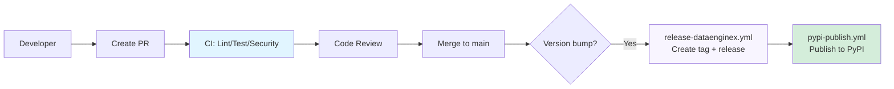

# CI/CD Pipeline

**Complete guide to DataEngineX continuous integration and release automation.**

> **Quick Links:** [CI Workflow](#continuous-integration-ci) · [Release Automation](#release-automation) · [PyPI Publishing](#pypi-publishing) · [Troubleshooting](#troubleshooting) · [Quick Reference](#quick-reference)

______________________________________________________________________

## 📋 Table of Contents

- [Overview](#overview)
- [Project Structure](#project-structure)
- [Continuous Integration (CI)](#continuous-integration-ci)
- [Release Automation](#release-automation)
- [PyPI Publishing](#pypi-publishing)
- [Rollback Procedures](#rollback-procedures)
- [Pipeline Metrics](#pipeline-metrics)
- [CI/CD Evolution](#cicd-evolution)
- [Troubleshooting](#troubleshooting)
- [Best Practices](#best-practices)
- [Related Documentation](#related-documentation)
- [Quick Reference](#quick-reference)

______________________________________________________________________

## Overview

DEX is a pure Python library published to PyPI. The pipeline is:

- **CI**: Automated testing, linting, and security scanning on every PR
- **Release**: Automated tagging and GitHub release creation on version bumps
- **PyPI Publish**: Automated publishing triggered by GitHub releases



______________________________________________________________________

## Project Structure

DEX is a single-package repo:

| Component | Location | Purpose | Release |
|-----------|----------|---------|---------|
| **dataenginex** | `src/dataenginex/` | Core framework (API, middleware, storage, ML) | PyPI (`dataenginex-vX.Y.Z`) |

### Unified Testing

The **root `pyproject.toml`** defines the package and test config:

- `name = "dataenginex"`, `version = "0.6.0"`
- `[tool.hatch.build.targets.wheel] packages = ["src/dataenginex"]`
- Dependency groups: `dev` (required), `data` (PySpark/Airflow), `notebook` (pandas), `ml` (sentence-transformers), `dashboard` (streamlit)

**CI workflow** (`ci.yml`) runs in a single pipeline:

- `lint-and-test` job: `uv sync` + `poe lint/test-cov`
- `integration-test` job (optional, label/dispatch): `uv sync --group data --group notebook`

### Separate Validation

- **Package validation** (`package-validation.yml`): Runs on every push to `main`/`dev` and `src/dataenginex/**` PR changes → builds wheel + twine check
- **Release automation**: `release-dataenginex.yml` watches root `pyproject.toml` for version changes → creates `dataenginex-vX.Y.Z` tag + release
- **PyPI publishing** (`pypi-publish.yml`): Triggered by DataEngineX release → detects changes in `src/dataenginex/` since last tag → publishes to PyPI

______________________________________________________________________

## Continuous Integration (CI)

**Workflow**: [`.github/workflows/ci.yml`](https://github.com/TheDataEngineX/DEX/blob/main/.github/workflows/ci.yml)

**Triggers**:

- Push to `main` or `dev` branches
- Pull requests targeting `main` or `dev`

**Jobs**:

### 1. Lint and Test

Runs code quality checks and test suite:

```bash
# Linting
uv run poe lint

# Tests with coverage
uv run poe test-cov
```

**Requirements**: All checks must pass before merge

### 2. Security Scans

Runs in parallel via [`.github/workflows/security.yml`](https://github.com/TheDataEngineX/DEX/blob/main/.github/workflows/security.yml):

- **CodeQL**: Static analysis for security vulnerabilities
- **Semgrep**: OWASP Top 10 and best practice checks

**Results**: Available in GitHub Security tab

### 3. Integration Test (Optional)

Optional job for full dependency coverage (PySpark, Airflow, Pandas):

**Trigger**:

- Manual: `gh workflow run ci.yml`
- Label: Add `full-test` label to pull request

**What it does**:

```bash
# Installs all dependency groups
uv sync --group dev --group data --group notebook

# Runs full test suite (may take longer)
uv run poe test-cov
```

**Use case**: Validate changes to data pipelines, ML models, or when adding new dependencies to `data` or `notebook` groups.

______________________________________________________________________

## Release Automation

### DataEngineX Releases

**Workflow**: [`.github/workflows/release-dataenginex.yml`](https://github.com/TheDataEngineX/DEX/blob/main/.github/workflows/release-dataenginex.yml)

**Trigger**: Version change in root `pyproject.toml` on `main` branch

**What it does**:

1. Detects version bump in root `pyproject.toml`
1. Extracts version (e.g., `0.6.0`)
1. Creates git tag: `dataenginex-v0.6.0`
1. Creates GitHub release → **automatically triggers `pypi-publish.yml`**

**How to release DataEngineX**:

```bash
# Update version in root pyproject.toml
version = "0.6.0"

# Commit and push
git add pyproject.toml
git commit -m "chore: bump dataenginex to 0.6.0"
git push origin main
```

______________________________________________________________________

## PyPI Publishing

**Workflow**: [`.github/workflows/pypi-publish.yml`](https://github.com/TheDataEngineX/DEX/blob/main/.github/workflows/pypi-publish.yml)

**Trigger**: GitHub release published (from `release-dataenginex.yml`)

**What it does**:

1. Receives GitHub release event from DataEngineX release
1. Detects if files under `src/dataenginex/` actually changed since previous `dataenginex-vX.Y.Z` tag
1. If changes found:
   - Builds wheel distributions
   - Publishes to TestPyPI (dry-run)
   - Promotes to PyPI (stable semver tags only, not pre-release)
1. If no changes: skips publishing with informational message

**Publish gates**:

- Only publishes if code actually changed (not just version bump in other files)
- TestPyPI first for dry-run verification
- PyPI promotion requires stable semver tag: `dataenginex-vMAJOR.MINOR.PATCH` (not `dataenginex-v1.2.3-rc1`)
- Pre-release tags: publish to TestPyPI only

**Automatic flow**:

```
DataEngineX version bump → release-dataenginex.yml → GitHub release → pypi-publish.yml → PyPI
```

**Manual trigger** (if needed):

```bash
gh workflow run pypi-publish.yml -f tag=dataenginex-v0.6.0
```

______________________________________________________________________

## Rollback Procedures

### Rollback a PyPI Release

PyPI does not support deleting releases, but you can:

1. Yank the release on PyPI (marks it as broken; `pip install` avoids it by default):

   ```bash
   # Via PyPI web UI: manage release → yank
   # Or via twine/API
   ```

1. Publish a patch release with the fix:

   ```bash
   # Bump version in pyproject.toml (e.g., 0.6.1)
   git commit -m "fix: revert breaking change"
   git push origin main
   ```

### Rollback a Git Tag

```bash
# Delete tag locally and remotely
git tag -d dataenginex-v0.6.0
git push origin :refs/tags/dataenginex-v0.6.0

# Delete the GitHub release via gh CLI
gh release delete dataenginex-v0.6.0 --yes
```

______________________________________________________________________

## Pipeline Metrics

### Build Times

- **CI (Lint + Test)**: ~2 minutes
- **Package validation**: ~1 minute
- **PyPI publish**: ~2 minutes

### Success Rates (Target)

- **CI Pass Rate**: >95%
- **Release Success Rate**: >99%

### Monitoring

```bash
# Recent CI runs
gh run list --workflow ci.yml --limit 10

# Recent releases
gh run list --workflow release-dataenginex.yml --limit 10

# Failed builds
gh run list --workflow pypi-publish.yml --status failure
```

______________________________________________________________________

## CI/CD Evolution

### Current State ✅

- [x] Automated CI with lint, test, type checks
- [x] Security scanning (CodeQL, Semgrep)
- [x] Automated PyPI release on version bump
- [x] Package validation (wheel + twine check)
- [x] GitHub Pages documentation deployment

### Future Enhancements 🚀

- [ ] **E2E smoke tests**: Post-release validation (install from PyPI and run examples)
- [ ] **SonarCloud integration**: Code quality gates
- [ ] **Slack notifications**: Release status updates
- [ ] **Release notes**: Auto-generated from commits
- [ ] **Canary releases**: TestPyPI smoke test before PyPI promotion

______________________________________________________________________

## Troubleshooting

### CI Fails with Lint Errors

```bash
# Run lint checks locally
uv run poe lint

# Auto-fix
uv run poe lint-fix
```

### PyPI Publish Not Triggering

- Verify version bump is in root `pyproject.toml` (not elsewhere)
- Confirm push was to `main` branch (not `dev`)
- Check `release-dataenginex.yml` ran and created a GitHub release
- View workflow logs: `gh run list --workflow pypi-publish.yml`

### Package Build Fails

```bash
# Build locally to diagnose
uv build
twine check dist/*

# Verify pyproject.toml metadata
uv run python -c "import dataenginex; print(dataenginex.__version__)"
```

______________________________________________________________________

## Best Practices

### Development Workflow

1. **Create feature branch** from `dev`
1. **Develop and test locally**
1. **Run quality checks** before committing: `uv run poe lint`, `uv run poe typecheck`, `uv run poe test`
1. **Create PR** targeting `dev`
1. **Wait for CI** to pass
1. **Get code review** approval
1. **Merge to dev** → integration testing
1. **Create release PR** from `dev` → `main`
1. **Merge to main** → bump version if releasing

### Commit Messages

Use conventional commits for clarity:

```bash
feat: add new endpoint for data processing
fix: resolve memory leak in pipeline
chore: update dependencies
docs: improve deployment runbook
test: add integration tests for API
```

### PR Guidelines

- **Keep PRs small**: \<500 lines of code
- **Single purpose**: One feature/fix per PR
- **Test coverage**: Include tests for new code
- **Documentation**: Update docs for API changes

______________________________________________________________________

## Related Documentation

**Next Steps:**

- **Deployment Runbook** (in `infradex` repo) - Release procedures
- **[Observability](OBSERVABILITY.md)** - Monitor applications built on DEX
- **[Contributing Guide](CONTRIBUTING.md)** - Development workflow

______________________________________________________________________

## Quick Reference

### Workflows Overview

| Workflow | Trigger | Purpose | File |
|----------|---------|---------|------|
| **CI** (Primary) | `push main/dev`, PRs to main/dev | Lint, test, type-check (dev deps) | [.github/workflows/ci.yml](https://github.com/TheDataEngineX/DEX/blob/main/.github/workflows/ci.yml) |
| **CI** (Integration) | PR label `full-test` or manual dispatch | Full test (data + notebook groups) | [.github/workflows/ci.yml](https://github.com/TheDataEngineX/DEX/blob/main/.github/workflows/ci.yml) |
| **Security** | `push main/dev`, PRs to main/dev | CodeQL + Semgrep scans | [.github/workflows/security.yml](https://github.com/TheDataEngineX/DEX/blob/main/.github/workflows/security.yml) |
| **Package** | Changes to `src/dataenginex/**` or `pyproject.toml` | Build wheel + twine check | [.github/workflows/package-validation.yml](https://github.com/TheDataEngineX/DEX/blob/main/.github/workflows/package-validation.yml) |
| **Release DataEngineX** | Version change in root `pyproject.toml` on main | Extract version, create `dataenginex-vX.Y.Z` tag + release | [.github/workflows/release-dataenginex.yml](https://github.com/TheDataEngineX/DEX/blob/main/.github/workflows/release-dataenginex.yml) |
| **PyPI Publish** | GitHub release (DataEngineX) published | Detect changes + publish dataenginex to TestPyPI/PyPI | [.github/workflows/pypi-publish.yml](https://github.com/TheDataEngineX/DEX/blob/main/.github/workflows/pypi-publish.yml) |

### Local Commands

```bash
# Local development
uv lock
uv sync
uv run poe test
uv run poe lint

# Local with all dependencies (data + notebook)
uv sync --group data --group notebook
uv run poe test-cov

# Create PR
gh pr create --title "feat: add feature" --body "Description"

# Trigger optional integration tests
gh pr edit <pr-number> --add-label full-test

# Check CI status
gh pr checks <pr-number>

# Monitor CI
gh run list --workflow ci.yml
gh run view <run-id> --log

# Manual PyPI publish
gh workflow run pypi-publish.yml -f tag=dataenginex-v0.6.0

# Promote to production (dev → main PR)
./scripts/promote.sh
```

______________________________________________________________________

**[← Back to Documentation Hub](docs-hub.md)**
