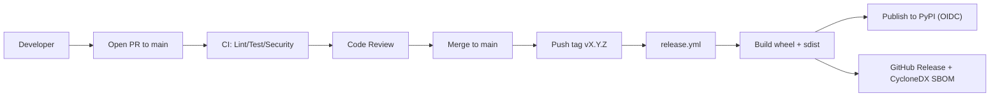

# CI/CD Pipeline

**Continuous integration and release automation for dataenginex.**

______________________________________________________________________

## Overview

dataenginex is a pure Python library published to PyPI. The pipeline is:

- **CI**: Linting, type checking, testing, and security scanning on every PR to `main`.
- **Release**: Push a `v{X.Y.Z}` tag to `main` → `release.yml` builds, publishes to PyPI, and creates a GitHub Release.



______________________________________________________________________

## Continuous Integration (CI)

**Workflow**: `.github/workflows/ci.yml`

**Triggers**:

- Push to `main`
- Pull requests targeting `main`

**Jobs**:

### 1. Quality (`quality`)

```bash
uv run ruff check src/ tests/
uv run mypy src/dataenginex/ --strict
```

### 2. Test (`test`)

```bash
uv run pytest tests/ -x --tb=short --cov=src/dataenginex/
```

Coverage threshold: 80%.

### 3. Package validation

```bash
uv build
```

### 4. Security Scans

Runs via the shared reusable workflow at `.github/workflows/security.yml`:

- **Trivy**: Misconfig and secret scan — results uploaded to GitHub Security tab.
- **CodeQL**: Handled by GitHub's default setup.

______________________________________________________________________

## Release Automation

**Workflow**: `.github/workflows/release.yml`

**Trigger**: Push a tag matching `v[0-9]+.[0-9]+.[0-9]+` to `main`.

**Jobs**:

1. **build** — `uv build` → upload wheel + sdist
1. **publish-pypi** — `pypa/gh-action-pypi-publish` (OIDC trusted publishing)
1. **github-release** — CycloneDX SBOM → `gh release create`

**How to release**:

```bash
git tag v1.2.3
git push origin v1.2.3
```

______________________________________________________________________

## Workflows Overview

| Workflow | Trigger | Purpose |
| --- | --- | --- |
| **CI** | Push/PR to main | Lint + typecheck + test + security |
| **Security** | Push/PR to main | Trivy misconfig + secret scan |
| **Release** | Push tag `v*.*.*` to main | Build → PyPI → GitHub Release |
