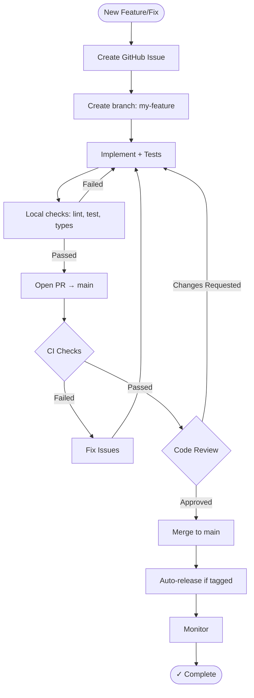

# SDLC Overview

**Software Development Lifecycle for DataEngineX - stages, artifacts, and quality gates.**

> **Quick Links:** [Lifecycle Stages](#lifecycle-stages) · [Development Workflow](#development-workflow-summary) · [Quality Gates](#4-verify-ci)

______________________________________________________________________

This document defines the software development lifecycle (SDLC) for DataEngineX, including the required stages, artifacts, and quality gates.

## Goals

- Ship deterministic builds with a single immutable image tag per change.
- Enforce quality gates (lint, test, type checks, security scan) on every PR.
- Maintain a complete audit trail for promotion across environments.

## Lifecycle Stages

### 1) Plan

**Entry**: Feature request, bug report, or operational task.

**Activities**:

- Define scope and acceptance criteria.
- Identify impacted services, APIs, or pipelines.
- Track work in GitHub Issues and GitHub Projects (milestones, priorities, owners).

**Exit**: Clear acceptance criteria and implementation plan.

**Artifacts**: GitHub Issue, Project card, checklist of deliverables.

Use the organization project space: `https://github.com/orgs/TheDataEngineX/projects`

______________________________________________________________________

### 2) Design

**Entry**: Approved plan.

**Activities**:

- Define interfaces, data contracts, and configuration changes.
- Update architecture or runbook docs if required.

**Exit**: Design reviewed and aligned.

**Artifacts**: Updated documentation, diagrams if applicable.

______________________________________________________________________

### 3) Implement

**Entry**: Approved design.

**Activities**:

- Develop in a short-lived feature branch.
- Add or update tests.
- Update docs if behavior or interfaces change.

**Exit**: Code complete and locally validated.

**Artifacts**: Code changes, tests, documentation updates.

______________________________________________________________________

### 4) Verify (CI)

**Entry**: Pull request opened against `main`.

**Required Checks**:

- CI, security, and quality checks as defined in the CI/CD pipeline.

See [CI/CD Pipeline](ci-cd.md) for the authoritative list of checks.

**Exit**: All checks pass and at least one reviewer approves.

**Artifacts**: CI logs, security scan reports, test results.

______________________________________________________________________

### 5) Release (CD)

**Entry**:

- PR merged to `main`.

**Actions**:

- Build container image once and tag with commit SHA.
- Push image to registry.
- Update environment manifests via GitOps.

**Exit**: New image tag recorded in git and ArgoCD sync completes.

**Artifacts**: Image tag, git commit updating kustomization, ArgoCD sync history.

______________________________________________________________________

### 6) Operate

**Entry**: Deployment complete.

**Activities**:

- Monitor application health and logs.
- Respond to alerts and incidents.
- Apply rollback if required.

**Exit**: Service stable and verified.

**Artifacts**: Alerts, logs, incident notes, rollback commits (if any).

## Development Workflow (Summary)

**Steps**:

1. Create a feature branch from `main`.
1. Implement changes, run local checks (`uv run poe check-all`).
1. Open a PR to `main` and request review.
1. Merge after all required checks pass.
1. Push a `vX.Y.Z` tag to trigger a PyPI release.

See [Contributing Guide](contributing.md) for branch naming, local checks, and PR conventions.

______________________________________________________________________

## Related Documentation

**Development:**

- **[Contributing Guide](contributing.md)** - Contribution workflow
- **[CI/CD Pipeline](ci-cd.md)** - Automated build and deploy

**Operations:**

- **Deployment Runbook** (in `infradex` repo) - Release procedures
- **Project Roadmap** (in the external `docs` repository) - Issue tracking and milestone source

______________________________________________________________________

**[← Back to Documentation](index.md)**
